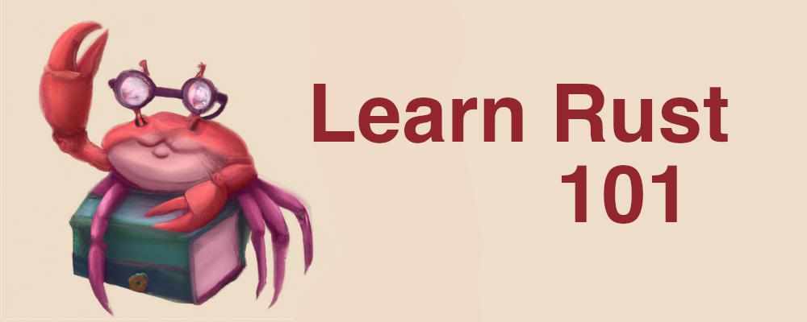

  

 

[rust]: https://www.rust-lang.org/

> ⓘ A guide to aid you in your journey of becoming a Rustacean (Rust developer). See the [Contributing](https://github.com/plabayo/learn-rust-101/blob/main/CONTRIBUTING.md) and [Code of Conduct](https://github.com/plabayo/learn-rust-101/blob/main/CODE_OF_CONDUCT.md) for more information about how to contribute to this repository.

## Disclaimer

This guide is made by [Glen De Cauwsemaecker](https://www.glendc.com/) and is in no way endorsed nor affiliated with the Rust foundation. Rust & Cargo are registered trademarks of the Rust foundation.

## Sharing is caring

This guide is free and will remain gratis available to share for all who are interested or until the overlords at GitHub pull it down.

🗞 This guide was featured [on the front page of HackerNews on the 8th of April 2023](<https://news.ycombinator.com/item?id=35489029>) and in [the weekly edition of the Rust newsletter on the 12th of April 2023](https://this-week-in-rust.org/blog/2023/04/12/this-week-in-rust-490/).

## Sponsors

Support this project by becoming a [sponsor](https://github.com/sponsors/plabayo).
